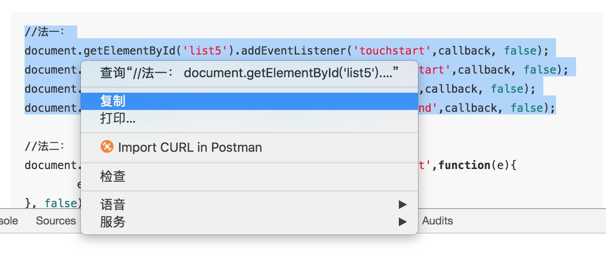
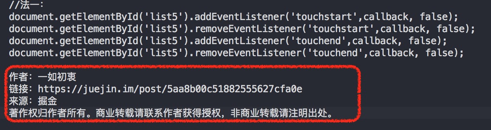

# ClipBoardCleaner
>一个用来清除剪贴板的“垃圾”的chrome插件

## Secnario
当你在某些网站比如[掘金](https://juejin.im/timeline)上复制内容的时候，它会往剪贴板里面塞一下“垃圾信息”，粘贴以后不得不*手工*去删掉多余的信息，for example:  
### 复制前：
 
### 粘贴后：
 

## Usage
下载src文件，打开chrome在地址栏输入chrome://extensions/，再点**加载已解压的扩展程序**，然后选择刚刚下载的src文件夹，即可食用
 